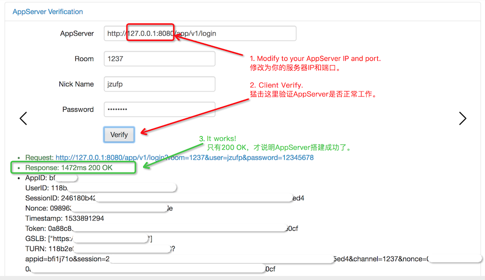
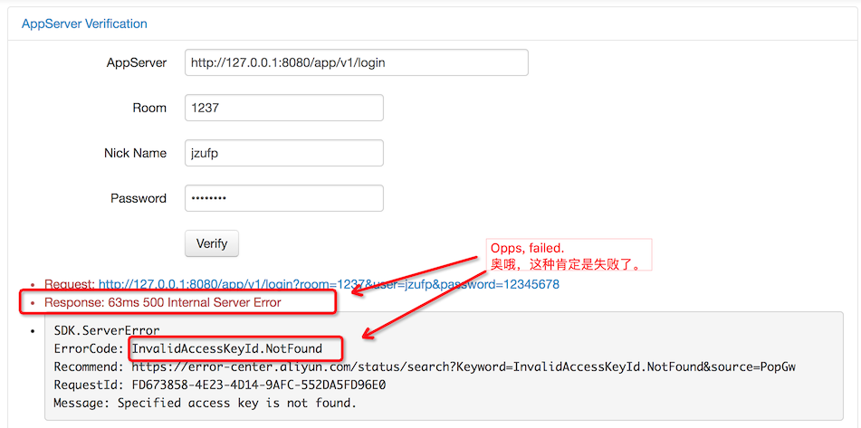

# AppServer

Nodejs AppServer for RTC.

> We depends on [@alicloud/rtc-2018-01-11](https://github.com/aliyun/aliyun-openapi-nodejs-sdk),
you can also update to the latest version.

## Usage

1. Generate AK from [here](https://usercenter.console.aliyun.com/#/manage/ak):

```
AccessKeyID: xxxxxxxxxxxxxxxx
AccessKeySecret: xxxxxxxxxxxxxxxxxxxxxxxxxxxxxx
```

2. Create APP from [here](https://rtc.console.aliyun.com/#/manage):

```
AppID: iwo5l81k
```

3. Clone project and generate config:

```
npm install &&
echo "module.exports = {" > config.js &&
echo "  listen: 8080," >> config.js &&
echo "  appId: 'iwo5l81k'," >> config.js &&
echo "  accessKeyId: 'xxxxxxxxxxxxxxxx'," >> config.js &&
echo "  accessKeySecret: 'xxxxxxxxxxxxxxxxxxxxxxxxxxxxxx'," >> config.js &&
echo "  endpoint: 'http://rtc.aliyuncs.com'," >> config.js &&
echo "  gslb: 'https://rgslb.rtc.aliyuncs.com'" >> config.js &&
echo "};" >> config.js &&
node index.js
```

4. Verify  your AppServer by [here](http://ossrs.net/talks/ng_index.html#/rtc-check?schema=http&host=127.0.0.1&port=8080&path=/app/v1/login&room=1237&user=jzufp&password=12345678) or [verify token](http://ossrs.net/talks/ng_index.html#/token-check).






> Remark: You can setup client native SDK by `http://30.2.228.19:8080/app/v1`.

> Remark: Please use your AppServer IP instead by `ifconfig eth0`.

