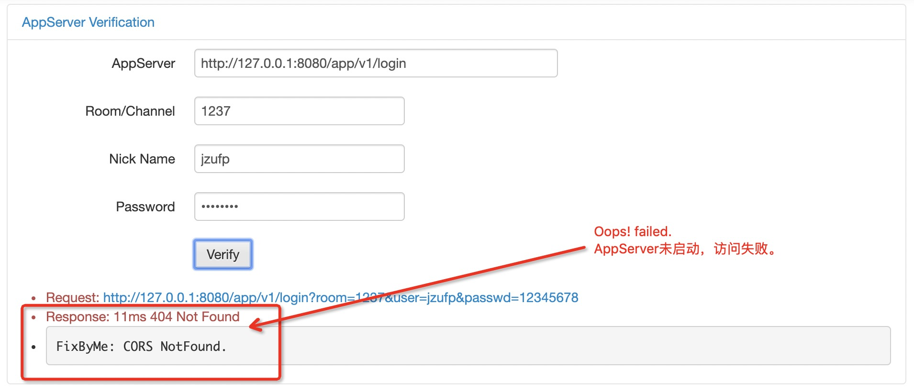

# AppServer

PHP AppServer for RTC.

## Usage

1. Create APP and APPKey from [here](https://rtc.console.aliyun.com/#/manage):

```
AppID: xxxxxxxx
AppKey: xxxxxxxxxxxxxxxxxxxxxxxxxxxxxxxxxxxx
```

2. Create Config.php by your data:

```
echo "<?php" > Config.php
echo "\$listen = 8080;" >> Config.php
echo "\$app_id = 'xxxxxxxx'; " >> Config.php
echo "\$app_key = 'xxxxxxxxxxxxxxxxxxxxxxxxxxxxxxxxxxxx'; " >> Config.php
echo "\$gslb = 'https://rgslb.rtc.aliyuncs.com'; " >> Config.php
echo "?>" >> Config.php
```

3. Verify your AppServer by [VerifyServer](../verify/README.md).




> Remark: You can setup client native SDK by `http://30.2.228.19:8080/app/v1`.

> Remark: Please use your AppServer IP instead by `ifconfig eth0`.

