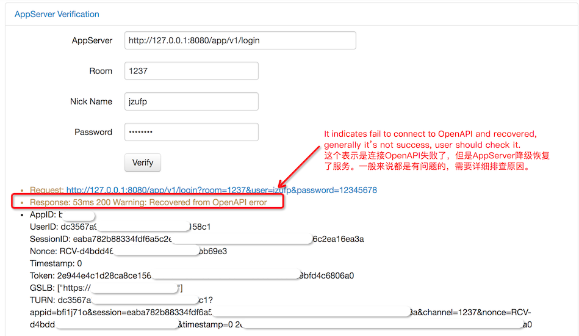

# AppServer

Python AppServer for AliRTC.

## CentOS6

1. Setup Python:

```
(pip --version 2>/dev/null || sudo yum install -y python-pip) &&
(rm -rf CherryPy-3.2.2 && unzip -q CherryPy-3.2.2.zip && cd CherryPy-3.2.2 && python setup.py install --user)
```

2. Install AliRTC OpenAPI SDK by:

```
pip install aliyun-python-sdk-rtc --user
```

> Remark: There maybe some errors, please ignore them.

3. Generate AK from [here](https://usercenter.console.aliyun.com/#/manage/ak):

```
AccessKeyID: xxxxxxxxxxxxxxxx
AccessKeySecret: xxxxxxxxxxxxxxxxxxxxxxxxxxxxxx
```

4. Create APP from [here](https://rtc.console.aliyun.com/#/manage):

```
AppID: iwo5l81k
```

5. Start AppServer, **use your information**:

```
./server.py --listen=8080 --access-key-id=xxxxxxxxxxxxxxxx \
	--access-key-secret=xxxxxxxxxxxxxxxxxxxxxxxxxxxxxx --appid=iwo5l81k \
	--gslb=https://rgslb.rtc.aliyuncs.com
```

6. Verify  your AppServer by [here](http://ossrs.net/talks/ng_index.html#/rtc-check?schema=http&host=127.0.0.1&port=8080&path=/app/v1/login&room=1237&user=jzufp&password=12345678) or [verify token](http://ossrs.net/talks/ng_index.html#/token-check).




> Remark: You can setup client native SDK by `http://30.2.228.19:8080/app/v1`.

> Remark: Please use your AppServer IP instead by `ifconfig eth0`.

## MacPro

1. Install `pip` for Python:

```
pip --version 2>/dev/null || sudo easy_install pip
```

or

```
url='https://files.pythonhosted.org/packages/ae/e8/2340d46ecadb1692a1e455f13f75e596d4eab3d11a57446f08259dee8f02/pip-10.0.1.tar.gz#sha256=f2bd08e0cd1b06e10218feaf6fef299f473ba706582eb3bd9d52203fdbd7ee68' &&
pip --version 2>/dev/null || (wget $url -O pip-10.0.1.tar.gz
tar xf pip-10.0.1.tar.gz && cd pip-10.0.1 &&
sudo python setup.py install)
```

2. Setup Python:

```
(rm -rf CherryPy-3.2.2 && unzip -q CherryPy-3.2.2.zip && cd CherryPy-3.2.2 && python setup.py install --user)
```

3. Install AliRTC OpenAPI SDK by:

```
sudo pip install aliyun-python-sdk-rtc
```

> Remark: There maybe some errors, please ignore them.

4. Generate AK from [here](https://usercenter.console.aliyun.com/#/manage/ak):

```
AccessKeyID: xxxxxxxxxxxxxxxx
AccessKeySecret: xxxxxxxxxxxxxxxxxxxxxxxxxxxxxx
```

5. Create APP from [here](https://rtc.console.aliyun.com/#/manage):

```
AppID: iwo5l81k
```

6. Start AppServer, **use your information**:

```
./server.py --listen=8080 --access-key-id=xxxxxxxxxxxxxxxx \
	--access-key-secret=xxxxxxxxxxxxxxxxxxxxxxxxxxxxxx --appid=iwo5l81k \
	--gslb=https://rgslb.rtc.aliyuncs.com
```

7. Verify  your AppServer by [here](http://ossrs.net/talks/ng_index.html#/rtc-check?schema=http&host=127.0.0.1&port=8080&path=/app/v1/login&room=1237&user=jzufp&password=12345678) or [verify token](http://ossrs.net/talks/ng_index.html#/token-check).


> Remark: You can setup client native SDK by `http://30.2.228.19:8080/app/v1`.

> Remark: Please use your AppServer IP instead by `ifconfig en0`.

## Windows

1. Unzip `CherryPy-3.2.2.zip` then install by:

```
cd CherryPy-3.2.2
python setup.py install --user
```

2. Download `pycryptodome` from [here](https://pypi.org/project/pycryptodome/#files), then unzip and install by:

```
cd pycryptodome-*
python setup.py install --user
```

3. Download Core SDK from [here](https://pypi.org/project/aliyun-python-sdk-core/#files), then unzip and install by:

```
cd aliyun-python-sdk-core-*
python setup.py install --user
```

4. Download RTC SDK from [here](https://pypi.org/project/aliyun-python-sdk-rtc/#files), then unzip and install by:

```
cd aliyun-python-sdk-rtc-*
python setup.py install --user
```


5. Generate AK from [here](https://usercenter.console.aliyun.com/#/manage/ak):

```
AccessKeyID: xxxxxxxxxxxxxxxx
AccessKeySecret: xxxxxxxxxxxxxxxxxxxxxxxxxxxxxx
```

6. Create APP from [here](https://rtc.console.aliyun.com/#/manage):

```
AppID: iwo5l81k
```

7. Start AppServer, **use your information**:

```
python server.py --listen=8080 --access-key-id=xxxxxxxxxxxxxxxx \
	--access-key-secret=xxxxxxxxxxxxxxxxxxxxxxxxxxxxxx --appid=iwo5l81k \
	--gslb=https://rgslb.rtc.aliyuncs.com
```

8. Verify  your AppServer by [here](http://ossrs.net/talks/ng_index.html#/rtc-check?schema=http&host=127.0.0.1&port=8080&path=/app/v1/login&room=1237&user=jzufp&password=12345678) or [verify token](http://ossrs.net/talks/ng_index.html#/token-check).


> Remark: You can setup client native SDK by `http://30.2.228.19:8080/app/v1`.

> Remark: Please use your AppServer IP instead by `ipconfig`.

## Links

AliRTC python OpenAPI SDK is [here](https://develop.aliyun.com/tools/sdk#/python).
